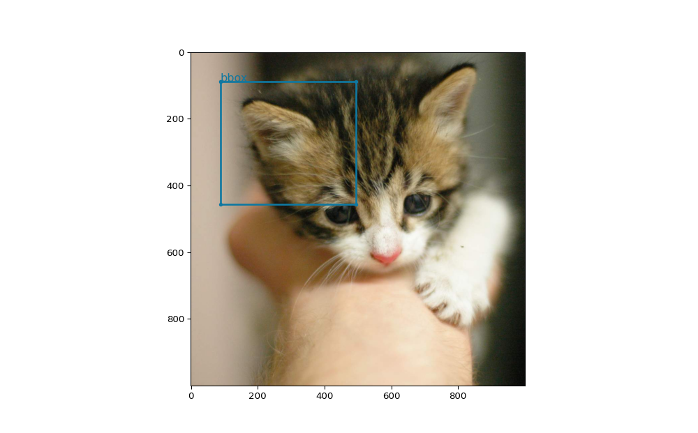

# YOLOv8 annotations viewer

A simple `matplotlib` based viewer for YoloV8 formatted annotations, so you can test
your code and systems that output this format.

## Requirements

* Python 3.9 or greater
* `matplotlib`

## Usage

* Install the deps from `requirements.txt` using `pip`
* Run the `view.py` file at CLI, follow prompts 

You must tell the code where the image is, where the labels are, and where the txt output YoloV8 is.
If valid, it will render a nice plot for you.

Nothing fancy, but it does the job, also works with polygons.